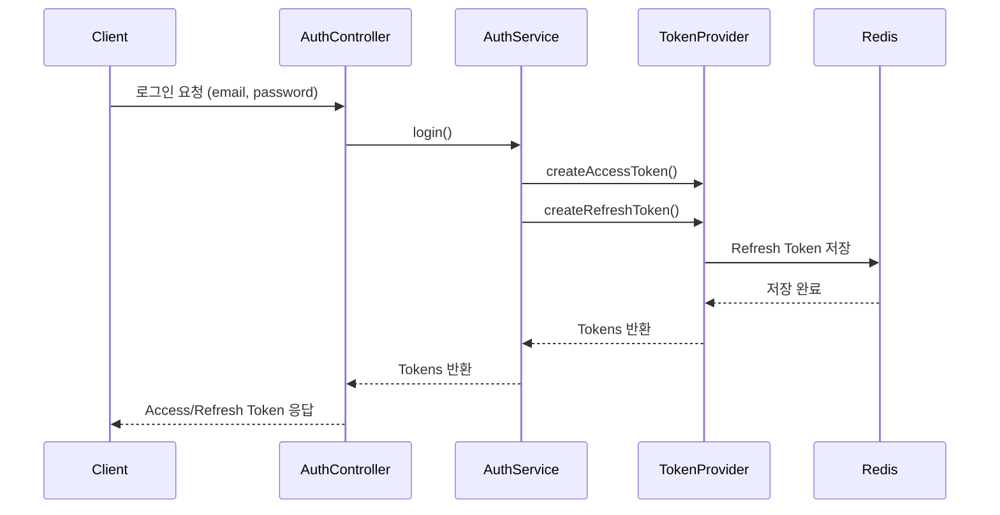

# KB 헬스케어 백엔드 채용 과제

## 개요
본 프로젝트는 삼성헬스・애플헬스 등 외부 헬스 데이터를 App to App 방식으로 연동하여,
단말에서 수집된 건강 데이터를 서버에 저장하고 회원별로 관리・집계하는 백엔드 서비스 과제입니다.
회원가입과 로그인, 건강데이터 업로드 및 조회 기능을 포함하며,
Redis를 활용한 캐싱 및 인증 처리, 데이터 집계 로직을 중심으로 구현되었습니다.

## 기술 스택
- **Language :** Java 17
- **Framework :** Spring Boot 3.5.7 / Spring Data JPA
- **Database :** MySQL 9.5.0
- **Cache :** Redis
- **Build & Dependency Management :** Gradle
- **Security :** Spring Security + JWT, BCrypt Encryption
- **Documentation :** Swagger (OpenAPI 3.0)

## 실행 방법
```bash
# Redis Docker 컨테이너 실행
docker run -d --name my-redis -p 6379:6379 redis

# git clone
git clone https://github.com/myohui/kb-healthcare-assignment.git
cd kb-healthcare-assignment

# 빌드 및 실행
./gradlew clean build
java -jar build/libs/kb-healthcare-0.0.1-SNAPSHOT.jar --spring.profiles.active=local
```
> Swagger는 로컬 환경에서만 활성화되어 있으며, http://localhost:8080/swagger-ui/index.html 에서 API 명세를 확인할 수 있습니다.

## 프로젝트 구조
```text
src
 ├── main
 │    ├── java/com/kb/healthcare/myohui
 │    │    ├── config                     # Security, Redis 등 전역 설정
 │    │    ├── controller                 # REST API 컨트롤러 (AuthController, MemberController 등)
 │    │    ├── domain                     
 │    │    │    ├── entity                # JPA 엔티티 클래스
 │    │    │    ├── dto                   # 요청(Request) / 응답(Response) DTO
 │    │    │    └── enums                 # Enum 정의
 │    │    ├── global                     
 │    │    │    ├── annotation            # 커스텀 어노테이션
 │    │    │    ├── cache                 # Redis 캐시 서비스
 │    │    │    ├── constant              # 전역 상수
 │    │    │    ├── enums                 # 전역 Enum
 │    │    │    ├── exception             # 전역 예외 처리 및 커스텀 예외 정의
 │    │    │    ├── jwt                   # JWT 토큰 생성/검증 및 필터
 │    │    │    └── util                  # 유틸리티 클래스
 │    │    ├── repository                 # JPA Repository 인터페이스
 │    │    └── service                    # 비즈니스 로직 계층
 │    └── KbHealthcareApplication.java
 └── resources
      ├── application.yml
      └── application-local.yml
```

## 데이터베이스 설계
[ERDCloud 바로가기](https://www.erdcloud.com/d/EbhBwxmPqkairuNPd)

<p align="left">
  
</p>

| 테이블                   | 설명                                                                                    |
|-----------------------|---------------------------------------------------------------------------------------|
| **member**            | 회원 정보 (이메일, 비밀번호, 이름, 닉네임)를 관리하는 테이블입니다.                                              |
| **health_data_raw**   | 삼성헬스·애플헬스 등 외부 기기에서 수집된 개별 세션 단위의 원본 건강 데이터(INPUT_DATA) 를 저장합니다. 일별 집계의 입력 데이터로 활용됩니다. |
| **health_data_daily** | health_data_raw 데이터를 기반으로 일 단위로 합산된 걸음수, 거리, 칼로리 데이터를 저장하며, 월별 통계 및 캐시 조회의 기반이 됩니다.   |

## 주요 기능
| 기능 | 설명                                      |
|---|-----------------------------------------|
| 회원가입 | 이메일, 비밀번호, 이름, 닉네임으로 회원가입               |
| 로그인 | 이메일, 비밀번호로 로그인, Access/Refresh Token 발급 |
| 로그아웃 | 서버에 저장된 Refresh Token을 만료시켜 현재 세션 무효화   |
| 토큰 재발급 | Refresh Token을 이용해 새로운 Access Token 발급  |
| 건강 데이터 저장 | RAW 건강 데이터 저장 및 일별 집계 처리 (비동기)          |
| 건강 데이터 조회 | 일별/월별 집계 데이터 조회 (Redis 캐시 적용)           |

## 구현 방법 및 설명
### 인증 아키텍처 (JWT + Redis)
인증은 JWT 기반 토큰 구조에 Redis를 통한 세션 제어 로직을 추가해 구현했습니다.
Refresh Token을 Redis에 key: memberId, value: refreshToken 형태로 저장하여
서버 단에서 직접 유효성을 검증하고, 로그아웃 시에는 즉시 삭제해 세션을 강제로 만료시킬 수 있습니다.
Access Token 만료 시에는 Redis에 저장된 토큰과 비교 검증 후 새 토큰을 재발급합니다.



### 캐시 아키텍처 (Redis)
건강 데이터는 회원별·일자별로 반복 조회가 많기 때문에, 조회 성능 향상을 위해 Redis 캐시 계층을 적용했습니다.
@Cacheable 대신, 캐시 키를 명시적으로 관리할 수 있도록 별도 CacheService를 구현했습니다.
- **캐시 조회**: 데이터 요청 시 Redis 캐시를 우선 확인
- **Cache Hi**t: 캐시 데이터 즉시 반환
- **Cache Miss**: DB 조회 후 Redis에 캐시 저장
- **캐시 무효화**: 건강 데이터 저장 시 회원의 일별/월별 캐시 삭제
 
> **참고:**  
> 건강 데이터 조회는 `recordKey` 단위로 이루어지며,  
> 회원이 여러 기기(recordKey)를 보유한 경우 각 기기별 데이터가 별도로 저장·조회됩니다.  
> 인증된 사용자(memberId)는 본인 소유의 recordKey 데이터만 조회할 수 있습니다.


## 발생한 이슈 및 해결 방법
### 1. `@Async` 비동기 호출 시 동일 스레드에서 실행되는 문제
- **문제**: `HealthDataService` 내부에서 `@Async`가 붙은 집계 메서드를 호출했으나, 비동기적으로 동작하지 않고 기존 부모 트랜잭션과 동일한 스레드에서 실행되었습니다.
- **원인**: `@Async`는 AOP 프록시 기반으로 동작하기 떄문에, 클래스 내부에서 자신의 메서드를 호출(`this.method()`)하는 경우, 프록시를 거치지 않아 AOP가 적용되지 않습니다.
- **해결**: 비동기 로직을 `HealthDataAggregator`라는 별도의 Bean으로 분리했습니다. `HealthDataService`가 외부 Bean인 `HealthDataAggregator`의 메서드를 호출하도록 구조를 변경하여, Spring이 프록시를 통해 해당 호출을 가로채 비동기 스레드 풀에 작업을 위임하도록 만들었습니다.

### 2. Redis 캐시 조회 시 `ClassCastException` 발생
- **문제**: `List<HealthDataDailyResponse>` 형태로 캐시 데이터를 읽어올 때, `List`로 형변환하는 과정에서 `ClassCastException`이 발생했습니다.
- **원인**:
  stream().toList()로 생성된 리스트가 ImmutableCollections.ListN 타입이라, Jackson이 JSON을 역직렬화할 때 사용하는 기본 컬렉션(ArrayList)과 타입이 맞지 않았습니다.
  여기에 DTO에 기본 생성자가 없어 Jackson이 객체를 생성하지 못하면서 예외가 함께 발생했습니다.
- **해결**:
  stream().collect(Collectors.toList())로 변경해 표준 ArrayList 형태로 데이터를 저장하도록 수정했습니다.
  또한 @NoArgsConstructor를 DTO에 추가해 Jackson이 역직렬화 시 객체를 정상적으로 생성할 수 있도록 처리했습니다.

## 데이터 조회 결과
> 모든 recordKey 별 건강 데이터 조회 결과는 [HealthDataSummary.md](HealthDataSummary.md) 파일에서 확인할 수 있습니다.

### Daily
| recordKey                            | Daily      | steps  | calories | distance |
| ------------------------------------ | ---------- | ------ | -------- | -------- |
| 7836887b-b12a-440f-af0f-851546504b13 | 2024-12-16 | 6,432  | 257.43   | 4.86     |
| 7836887b-b12a-440f-af0f-851546504b13 | 2024-12-15 | 4,245  | 167.83   | 3.21     |
| 7836887b-b12a-440f-af0f-851546504b13 | 2024-12-14 | 4,797  | 191.80   | 3.66     |
| 7836887b-b12a-440f-af0f-851546504b13 | 2024-12-13 | 8,102  | 325.22   | 6.13     |
| 7836887b-b12a-440f-af0f-851546504b13 | 2024-12-12 | 7,093  | 285.37   | 5.41     |
| 7836887b-b12a-440f-af0f-851546504b13 | 2024-12-11 | 7,513  | 302.82   | 5.59     |
| 7836887b-b12a-440f-af0f-851546504b13 | 2024-12-10 | 6,546  | 265.09   | 4.96     |
| 7836887b-b12a-440f-af0f-851546504b13 | 2024-12-09 | 8,659  | 346.15   | 6.61     |
| ... | | | | |

### Monthly
| recordKey                            | Monthly | steps   | calories | distance |
| ------------------------------------ | ------- | ------- | -------- | -------- |
| 2024-12 | 108,912 | 4,893.59 | 77.23 | 7836887b-b12a-440f-af0f-851546504b13 |
| 2024-11 | 120,594 | 4,752.75 | 88.67 | 7836887b-b12a-440f-af0f-851546504b13 |


## 산출물
- **Health Check**: http://localhost:8080/actuator/health
- **Swagger** : http://localhost:8080/swagger-ui/index.html
- **Postman Collection** : https://documenter.getpostman.com/view/28055530/2sB3Wtqy5X

## 마무리
이번 과제를 통해 Redis를 활용한 캐시 적용과 상태 기반 인증 아키텍처를 설계하고 구현하는 경험을 할 수 있었습니다.
특히 발생 가능한 이슈들을 미리 예측하고, 원인을 분석하여 해결하는 과정에서 시스템의 안정성과 성능을 함께 고려하는 능력을 기를 수 있었습니다. 
앞으로도 서비스 확장성과 유지보수성을 고려한 방향으로 구조를 고도화해 나가겠습니다.

> **<p>향후 고려할 점</p>**
현재 비동기 (@Async)로 처리되는 건강 데이터 집계 로직은 과제 범위 내에서는 충분하지만, 
실제 대규모 서비스에서는 데이터 무결성을 위해 메시지 큐(Kafka/RabbitMQ 등) 도입이 필수적이라고 판단하고 있습니다.
다만, 과제 전형의 목적과 오버 엔지니어링을 피하기 위해 이번 구현에서는 제외했지만, 확장 시 고려해야 할 사항으로 남겨두고자 합니다.